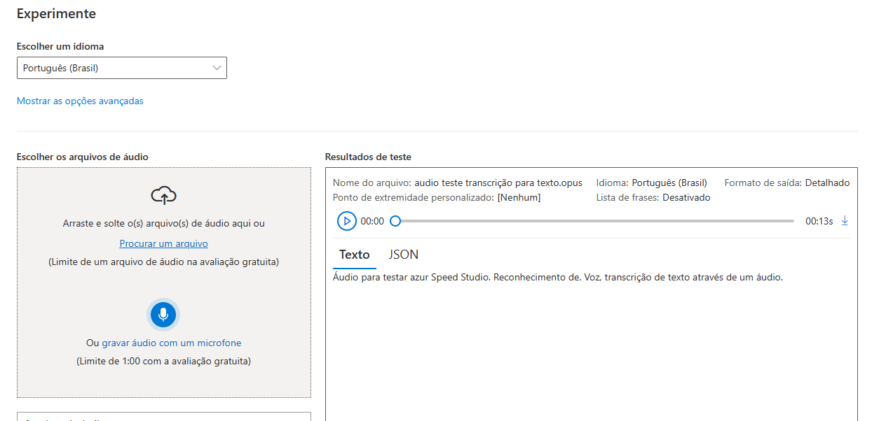
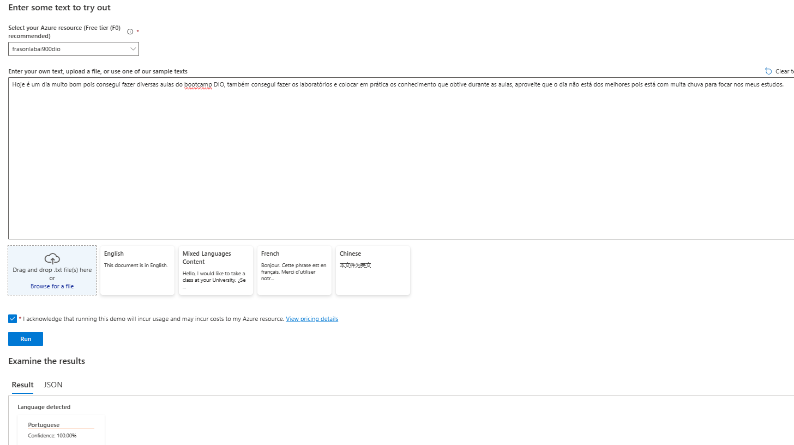
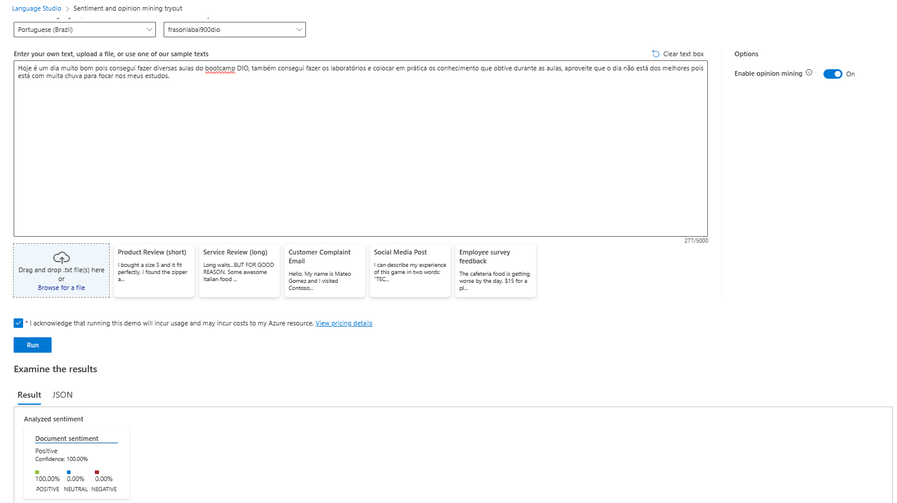

## Desafio Language Studio, Bootcamp Azure AI DIO
Olá, me chamo Gustavo Frason, e estou participando do Bootcamp Microsoft AI oferifico pela DIO, o objetivo deste material e passar alguns exemplo do que pode ser feito utilizando os serviços de fala e texto da Microsoft.

## Exemplo utilizando o serviço de conversão de aúdio em texto (Speech.microsoft)

## Exemplo utilizando o language studio explorei diversos serviços
    ### Como por exemplo o serviço de reconhecer a linguagem de um texto:

    ### Outro serviço incrível foi o de análise comportamental
